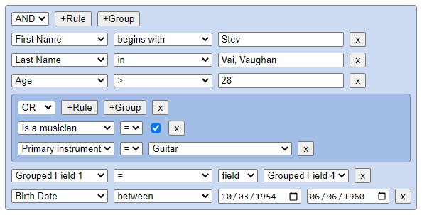

# react-querybuilder

[](https://www.npmjs.com/package/react-querybuilder)
[](https://travis-ci.org/sapientglobalmarkets/react-querybuilder)
[](https://codecov.io/github/sapientglobalmarkets/react-querybuilder?branch=master)

## Credits
This component was inspired by prior work from:

- [jQuery QueryBuilder](http://querybuilder.js.org/)
- [Angular QueryBuilder](https://github.com/mfauveau/angular-query-builder)


## Getting Started



```shell
npm install react-querybuilder --save
```
## Demo

Open `<path-to-project>/node_modules/react-querybuilder/demo/index.html` in your browser.

OR

[See live Demo](https://sapientglobalmarkets.github.io/react-querybuilder/).


## Usage

```jsx
import QueryBuilder from 'react-querybuilder';

const fields = [
    {name: 'firstName', label: 'First Name'},
    {name: 'lastName', label: 'Last Name'},
    {name: 'age', label: 'Age'},
    {name: 'address', label: 'Address'},
    {name: 'phone', label: 'Phone'},
    {name: 'email', label: 'Email'},
    {name: 'twitter', label: 'Twitter'},
    {name: 'isDev', label: 'Is a Developer?', value: false},
];

const dom = <QueryBuilder fields={fields}
                          onQueryChange={logQuery}/>


function logQuery(query) {
    console.log(query);
}

```

## API

`<QueryBuilder />` is the only top-level component exposed from this library. It supports the following properties:

#### fields *(Required)*
[ {name:String, label:String, id:ID} ]

The array of fields that should be used. Each field should be an object with

`{name:String, label:String, id:ID}` |

The Id is optional, if you do not provide an id for a field then the name will be used


#### operators *(Optional)*
[ {name:String, label:String} ]

The array of operators that should be used. The default operators include:

```js
[
    {name: 'null', label: 'Is Null'},
    {name: 'notNull', label: 'Is Not Null'},
    {name: 'in', label: 'In'},
    {name: 'notIn', label: 'Not In'},
    {name: '=', label: '='},
    {name: '!=', label: '!='},
    {name: '<', label: '<'},
    {name: '>', label: '>'},
    {name: '<=', label: '<='},
    {name: '>=', label: '>='},
]
```

#### combinators *(Optional)*
[ {name:String, label:String} ]

The array of combinators that should be used for RuleGroups.
The default set includes:

```js
[
    {name: 'and', label: 'AND'},
    {name: 'or', label: 'OR'},
]
```

#### controlElements *(Optional)*
```js
React.PropTypes.shape({
  addGroupAction: React.PropTypes.func, //returns ReactClass
  removeGroupAction: React.PropTypes.func, //returns ReactClass
  addRuleAction: React.PropTypes.func, //returns ReactClass
  removeRuleAction: React.PropTypes.func, //returns ReactClass
  combinatorSelector: React.PropTypes.func, //returns ReactClass
  fieldSelector: React.PropTypes.func, //returns ReactClass
  operatorSelector: React.PropTypes.func, //returns ReactClass
  valueEditor: React.PropTypes.func //returns ReactClass
})
```

This is a custom controls object that allows you to override the control elements used.
The following control overrides are supported:
- `addGroupAction`: By default a `<button />` is used. The following props are passed:

  ```js
  {
    label: React.PropTypes.string, //"+Group"
    className: React.PropTypes.string, //css classNames to be applied
    handleOnClick: React.PropTypes.func, //callback function to invoke adding a <RuleGroup />
    rules: React.PropTypes.array, //Provides the number of rules already present for this group,
    level: React.PropTypes.number //The level of the current group
  }
  ```
- `removeGroupAction`: By default a `<button />` is used. The following props are passed:

  ```js
  {
    label: React.PropTypes.string, //"x"
    className: React.PropTypes.string, //css classNames to be applied
    handleOnClick: React.PropTypes.func, //callback function to invoke removing a <RuleGroup />
    rules: React.PropTypes.array, //Provides the number of rules already present for this group,
    level: React.PropTypes.number //The level of the current group
  }
  ```
- `addRuleAction`: By default a `<button />` is used. The following props are passed:

  ```js
  {
    label: React.PropTypes.string, //"+Rule"
    className: React.PropTypes.string, //css classNames to be applied
    handleOnClick: React.PropTypes.func, //callback function to invoke adding a <Rule />
    rules: React.PropTypes.array, //Provides the number of rules already present for this group,
    level: React.PropTypes.number //The level of the current group
  }
  ```
- `removeRuleAction`: By default a `<button />` is used. The following props are passed:

  ```js
  {
    label: React.PropTypes.string, //"x"
    className: React.PropTypes.string, //css classNames to be applied
    handleOnClick: React.PropTypes.func, //callback function to invoke removing a <Rule />
    level: React.PropTypes.number //The level of the current group
  }
  ```
- `combinatorSelector`: By default a `<select />` is used. The following props are passed:

  ```js
  {
    options: React.PropTypes.array.isRequired, //same as 'combinators' passed into QueryBuilder
    value: React.PropTypes.string, //selected combinator from the existing query representation, if any
    className: React.PropTypes.string, //css classNames to be applied
    handleOnChange: React.PropTypes.func, //callback function to update query representation
    rules: React.PropTypes.array, //Provides the number of rules already present for this group
    level: React.PropTypes.number //The level of the current group
  }
  ```
- `fieldSelector`: By default a `<select />` is used. The following props are passed:

  ```js
  {
    options: React.PropTypes.array.isRequired, //same as 'fields' passed into QueryBuilder
    value: React.PropTypes.string, //selected field from the existing query representation, if any
    className: React.PropTypes.string, //css classNames to be applied
    handleOnChange: React.PropTypes.func, //callback function to update query representation
    level: React.PropTypes.number //The level the group this rule belongs to
  }
  ```
- `operatorSelector`: By default a `<select />` is used. The following props are passed:

  ```js
  {
    field: React.PropTypes.string, //field name corresponding to this Rule
    options: React.PropTypes.array.isRequired, //return value of getOperators(field)
    value: React.PropTypes.string, //selected operator from the existing query representation, if any
    className: React.PropTypes.string, //css classNames to be applied
    handleOnChange: React.PropTypes.func //callback function to update query representation
    level: React.PropTypes.number //The level the group this rule belongs to
  }
  ```
- `valueEditor`: By default a `<input type="text" />` is used. The following props are passed:

  ```js
  {
    field: React.PropTypes.string, //field name corresponding to this Rule
    operator: React.PropTypes.string, //operator name corresponding to this Rule
    value: React.PropTypes.string, //value from the existing query representation, if any
    handleOnChange: React.PropTypes.func //callback function to update the query representation
    level: React.PropTypes.number //The level the group this rule belongs to
  }
  ```

#### getOperators *(Optional)*
function(field):[]

This is a callback function invoked to get the list of allowed operators
for the given field

#### onQueryChange *(Optional)*
function(queryJSON):void

This is a notification that is invoked anytime the query configuration changes. The
query is provided as a JSON structure, as shown below:

```json
{
  "combinator": "and",
  "rules": [
    {
      "field": "firstName",
      "operator": "null",
      "value": ""
    },
    {
      "field": "lastName",
      "operator": "null",
      "value": ""
    },
    {
      "combinator": "and",
      "rules": [
        {
          "field": "age",
          "operator": ">",
          "value": "30"
        }
      ]
    }
  ]
}
```

#### controlClassnames *(Optional)*
This can be used to assign specific `CSS` classes to various controls
that are created by the `<QueryBuilder />`. This is an object
with the following properties:

```js
{
    queryBuilder:String, // Root <div> element

    ruleGroup:String, // <div> containing the RuleGroup
    combinators:String, // <select> control for combinators
    addRule:String, // <button> to add a Rule
    addGroup:String, // <button> to add a RuleGroup
    removeGroup:String, // <button> to remove a RuleGroup

    rule:String, // <div> containing the Rule
    fields:String, // <select> control for fields
    operators:String, // <select> control for operators
    value:String, // <input> for the field value
    removeRule:String // <button> to remove a Rule

}
```

#### translations *(Optional)*
This can be used to override translatable texts applied to various controls
that are created by the `<QueryBuilder />`. This is an object
with the following properties:

```js
{
    fields: {
        title: "Fields",
    },
    operators: {
        title: "Operators",
    },
    value: {
        title: "Value",
    },
    removeRule: {
        label: "x",
        title: "Remove rule",
    },
    removeGroup: {
        label: "x",
        title: "Remove group",
    },
    addRule: {
        label: "+Rule",
        title: "Add rule",
    },
    addGroup: {
        label: "+Group",
        title: "Add group",
    },
    combinators: {
        title: "Combinators",
    }
}
```


## Development

### Changelog Generation

We are using [github-changes](https://github.com/lalitkapoor/github-changes) to generate the changelog.

To use it:

1. tag your commit using [semantic versioning](http://semver.org/)
1. run `npm run generate-changelog`
1. enter your github credentials at the prompt
1. commit
1. push your commit and tags
