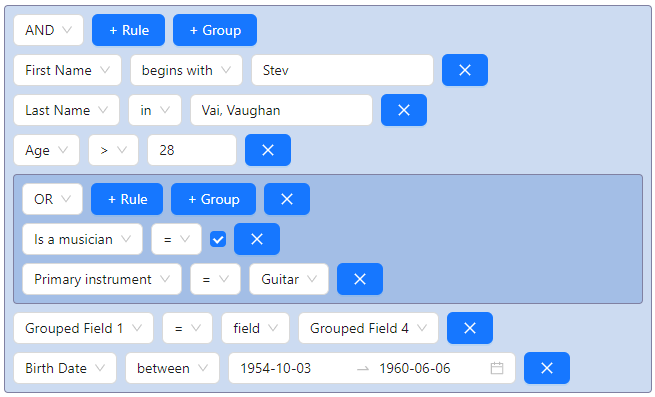

## @react-querybuilder/antd

Official [react-querybuilder](https://npmjs.com/package/react-querybuilder) compatibility package for [Ant Design](https://ant.design/).

- [Demo](https://react-querybuilder.js.org/demo/antd)
- [Full documentation](https://react-querybuilder.js.org/)
- [CodeSandbox](https://react-querybuilder.js.org/sandbox?t=antd) / [StackBlitz](https://react-querybuilder.js.org/sandbox?p=stackblitz&t=antd) example projects



## Installation

```bash
npm i react-querybuilder @react-querybuilder/antd @ant-design/icons antd
# OR yarn add / pnpm add / bun add
```

## Usage

To configure the query builder to use Ant Design-compatible components, place `QueryBuilderAntD` above `QueryBuilder` in the component hierarchy.

```tsx
import { QueryBuilderAntD } from '@react-querybuilder/antd';
import { useState } from 'react';
import { type Field, QueryBuilder, type RuleGroupType } from 'react-querybuilder';

const fields: Field[] = [
  { name: 'firstName', label: 'First Name' },
  { name: 'lastName', label: 'Last Name' },
];

export function App() {
  const [query, setQuery] = useState<RuleGroupType>({ combinator: 'and', rules: [] });

  return (
    <QueryBuilderAntD>
      <QueryBuilder fields={fields} defaultQuery={query} onQueryChange={setQuery} />
    </QueryBuilderAntD>
  );
}
```

> [!NOTE]
>
> You may also want to reduce the width of the value editor component (which is 100% by default) with the following CSS rule.
>
> ```css
> .queryBuilder .ant-input {
>   width: auto;
> }
> ```

`QueryBuilderAntD` is a React context provider that assigns the following props to all descendant `QueryBuilder` elements. The props can be overridden on the `QueryBuilder` or used directly without the context provider.

| Export                | `QueryBuilder` prop             |
| --------------------- | ------------------------------- |
| `antdControlElements` | `controlElements`               |
| `antdTranslations`    | `translations`                  |
| `AntDActionElement`   | `controlElements.actionElement` |
| `AntDDragHandle`      | `controlElements.dragHandle`    |
| `AntDNotToggle`       | `controlElements.notToggle`     |
| `AntDShiftActions`    | `controlElements.shiftActions`  |
| `AntDValueEditor`     | `controlElements.valueEditor`   |
| `AntDValueSelector`   | `controlElements.valueSelector` |

> [!TIP]
>
> By default, this package uses icons from `@ant-design/icons` for button labels. To reset button labels to their default strings, use `defaultTranslations` from `react-querybuilder`.
>
> ```tsx
> <QueryBuilderAntD translations={defaultTranslations}>
> ```
