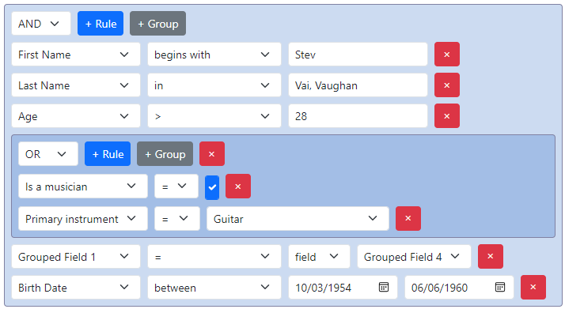

## @react-querybuilder/bootstrap

Official [react-querybuilder](https://npmjs.com/package/react-querybuilder) compatibility package for [Bootstrap](https://getbootstrap.com/).

- [Demo](https://react-querybuilder.js.org/demo/bootstrap)
- [Full documentation](https://react-querybuilder.js.org/)
- [CodeSandbox](https://react-querybuilder.js.org/sandbox?t=bootstrap) / [StackBlitz](https://react-querybuilder.js.org/sandbox?p=stackblitz&t=bootstrap) example projects



## Installation

```bash
npm i react-querybuilder @react-querybuilder/bootstrap bootstrap bootstrap-icons
# OR yarn add / pnpm add / bun add
```

## Usage

To configure the query builder to use Bootstrap-compatible components, place `QueryBuilderBootstrap` above `QueryBuilder` in the component hierarchy.

```tsx
import { QueryBuilderBootstrap } from '@react-querybuilder/bootstrap';
import 'bootstrap-icons/font/bootstrap-icons.scss';
import 'bootstrap/scss/bootstrap.scss';
import { useState } from 'react';
import { type Field, QueryBuilder, type RuleGroupType } from 'react-querybuilder';

const fields: Field[] = [
  { name: 'firstName', label: 'First Name' },
  { name: 'lastName', label: 'Last Name' },
];

export function App() {
  const [query, setQuery] = useState<RuleGroupType>({ combinator: 'and', rules: [] });

  return (
    <QueryBuilderBootstrap>
      <QueryBuilder fields={fields} defaultQuery={query} onQueryChange={setQuery} />
    </QueryBuilderBootstrap>
  );
}
```

> [!NOTE]
>
> Some additional styling may be necessary. We recommend the following:
>
> ```css
> .queryBuilder .form-control,
> .queryBuilder .form-select {
>   display: inline-block;
>   width: auto;
> }
> ```

`QueryBuilderBootstrap` is a React context provider that assigns the following props to all descendant `QueryBuilder` elements. The props can be overridden on the `QueryBuilder` or used directly without the context provider.

| Export                       | `QueryBuilder` prop           |
| ---------------------------- | ----------------------------- |
| `bootstrapControlClassnames` | `controlClassnames`           |
| `bootstrapControlElements`   | `controlElements`             |
| `bootstrapTranslations`      | `translations`                |
| `BootstrapNotToggle`         | `controlElements.notToggle`   |
| `BootstrapValueEditor`       | `controlElements.valueEditor` |

> [!TIP]
>
> By default, this package uses icons from `bootstrap-icons` for button labels. To reset button labels to their default strings, use `defaultTranslations` from `react-querybuilder`.
>
> ```tsx
> <QueryBuilderBootstrap translations={defaultTranslations}>
> ```
