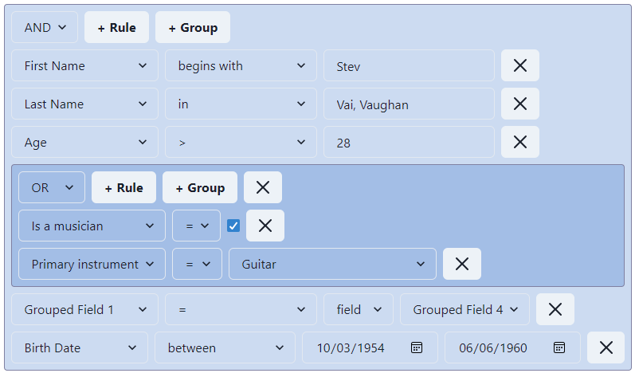

## @react-querybuilder/chakra

Official [react-querybuilder](https://npmjs.com/package/react-querybuilder) compatibility package for [Chakra UI](https://chakra-ui.com/).

- [Demo](https://react-querybuilder.js.org/demo/chakra)
- [Full documentation](https://react-querybuilder.js.org/)
- [CodeSandbox](https://react-querybuilder.js.org/sandbox?t=chakra) / [StackBlitz](https://react-querybuilder.js.org/sandbox?p=stackblitz&t=chakra) example projects



## Installation

```bash
npm i react-querybuilder @react-querybuilder/chakra @chakra-ui/react @emotion/react react-icons
# OR yarn add / pnpm add / bun add
```

## Usage

To configure the query builder to use Chakra-compatible components, place `QueryBuilderChakra` above `QueryBuilder` and beneath `ChakraProvider` in the component hierarchy.

```tsx
import { ChakraProvider, createSystem, defaultConfig, Theme } from '@chakra-ui/react';
import { QueryBuilderChakra } from '@react-querybuilder/chakra';
import { useState } from 'react';
import { type Field, QueryBuilder, type RuleGroupType } from 'react-querybuilder';

const chakraTheme = createSystem(defaultConfig);

const fields: Field[] = [
  { name: 'firstName', label: 'First Name' },
  { name: 'lastName', label: 'Last Name' },
];

export function App() {
  const [query, setQuery] = useState<RuleGroupType>({ combinator: 'and', rules: [] });

  return (
    <ChakraProvider value={chakraTheme}>
      <Theme colorPalette="teal">
        <QueryBuilderChakra>
          <QueryBuilder fields={fields} defaultQuery={query} onQueryChange={setQuery} />
        </QueryBuilderChakra>
      </Theme>
    </ChakraProvider>
  );
}
```

> [!NOTE]
>
> Some additional styling may be necessary. We recommend the following:
>
> ```css
> .queryBuilder .chakra-native-select__root {
>   width: fit-content;
>   display: inline-block;
> }
>
> .queryBuilder .chakra-input {
>   width: auto;
>   display: inline-block;
> }
> ```

`QueryBuilderChakra` is a React context provider that assigns the following props to all descendant `QueryBuilder` elements. The props can be overridden on the `QueryBuilder` or used directly without the context provider.

| Export                  | `QueryBuilder` prop             |
| ----------------------- | ------------------------------- |
| `chakraControlElements` | `controlElements`               |
| `chakraTranslations`    | `translations`                  |
| `ChakraActionElement`   | `controlElements.actionElement` |
| `ChakraNotToggle`       | `controlElements.notToggle`     |
| `ChakraValueEditor`     | `controlElements.valueEditor`   |
| `ChakraValueSelector`   | `controlElements.valueSelector` |

> [!TIP]
>
> By default, this package uses icons from `react-icons` for button labels. To reset button labels to their default strings, use `defaultTranslations` from `react-querybuilder`.
>
> ```tsx
> <QueryBuilderChakra translations={defaultTranslations}>
> ```
