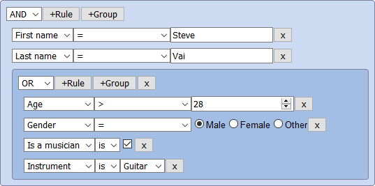

## @react-querybuilder/datetime

Augments [react-querybuilder](https://npmjs.com/package/react-querybuilder) with enhanced date/time functionality.

To see this in action, check out the [`react-querybuilder` demo](https://react-querybuilder.js.org/demo#datetime=true) with the "date/time" option enabled.

**[Full documentation](https://react-querybuilder.js.org/docs/datetime)**

<!--  -->

## Installation

```bash
npm i react-querybuilder @react-querybuilder/datetime
# OR yarn add / pnpm add / bun add
```

## Usage

To enable the date and time functionality of a query builder, nest the `QueryBuilder` element under `QueryBuilderDateTime`.

```tsx
import { QueryBuilderDateTime } from '@react-querybuilder/datetime/ui';
import { useState } from 'react';
import { QueryBuilder, RuleGroupType } from 'react-querybuilder';

const fields = [
  { name: 'firstName', label: 'First Name' },
  { name: 'lastName', label: 'Last Name' },
];

const App = () => {
  const [query, setQuery] = useState<RuleGroupType>({ combinator: 'and', rules: [] });

  return (
    <QueryBuilderDateTime>
      <QueryBuilder fields={fields} defaultQuery={query} onQueryChange={setQuery} />
    </QueryBuilderDateTime>
  );
};
```

All React exports live in the `/ui` entry point (`@react-querybuilder/datetime/ui`); the root entry is framework-agnostic, exporting only rule processors, utilities, and types.

- **`QueryBuilderDateTime`** — the context provider shown above. Accepts optional config props (`anchors`, `units`, `toggleLabels`, `modeController`, `dateTimeAPI`) to customize the relative date/time editor.
- **`RelativeDateTimeValueEditor`** — the value editor itself, for use directly via `controlElements` when you'd rather not wrap with the provider.
- **Mode controllers** — `toggleModeController` (the default absolute/relative toggle button) and `createOperatorModeController` (derives the mode from the rule's operator), plus the `withRelativeOperators` field helper.

See the [Components documentation](https://react-querybuilder.js.org/docs/datetime#components) for relative values, mode controllers, and configuration.

To add date/time functionality to `formatQuery`, import a rule processor from `@react-querybuilder/datetime/dayjs`, `@react-querybuilder/datetime/date-fns`, or `@react-querybuilder/datetime/luxon`—depending on which library you wish to use or are already using—and pass it to the `ruleProcessor` option.

```ts
import { formatQuery } from 'react-querybuilder';
import {
  datetimeRuleProcessorMongoDBQuery,
  datetimeRuleProcessorSQL,
} from '@react-querybuilder/datetime/dayjs';

// SQL
formatQuery(query, { preset: 'postgresql', fields, ruleProcessor: datetimeRuleProcessorSQL });

// MongoDB
formatQuery(query, {
  format: 'mongodb_query',
  fields,
  ruleProcessor: datetimeRuleProcessorMongoDBQuery,
});
```

The date/time rule processors will fallback to using the default rule processors if the rule's field configuration does not have a `datatype` value of "date", "datetime", "datetimeoffset", or "timestamp", or if the `operator` is specific to string comparisons ("contains", "beginsWith", "endsWith", etc.). You can provide a custom `isDateField` function to override this behavior through the `context` option.

<!-- ## Notes -->
