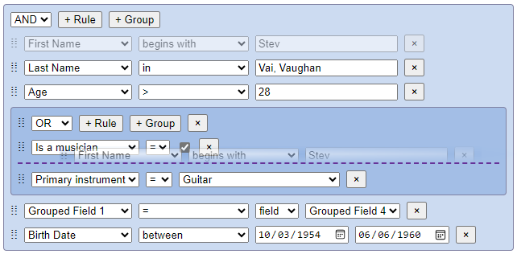

## @react-querybuilder/dnd

Augments [react-querybuilder](https://npmjs.com/package/react-querybuilder) with drag-and-drop functionality.

To see this in action, check out the [`react-querybuilder` demo](https://react-querybuilder.js.org/demo#enableDragAndDrop=true) with the drag-and-drop option enabled.

**[Full documentation](https://react-querybuilder.js.org/)**



## Installation

```bash
npm i react-querybuilder @react-querybuilder/dnd
# OR yarn add / pnpm add / bun add
```

Then install the drag-and-drop library of your choice (see [Adapters](#adapters)).

## Usage

Nest `QueryBuilder` under a `QueryBuilderDnD` provider, passing an adapter to the `dnd` prop:

```tsx
import { QueryBuilderDnD } from '@react-querybuilder/dnd';
import { createReactDnDAdapter } from '@react-querybuilder/dnd/react-dnd';
import * as ReactDnD from 'react-dnd';
import * as ReactDndBackend from 'react-dnd-html5-backend';
import { QueryBuilder } from 'react-querybuilder';

const adapter = createReactDnDAdapter({ ...ReactDnD, ...ReactDndBackend });

const App = () => (
  <QueryBuilderDnD dnd={adapter}>
    <QueryBuilder />
  </QueryBuilderDnD>
);
```

## Adapters

`@react-querybuilder/dnd` uses an adapter pattern to support multiple drag-and-drop libraries without requiring all of them as dependencies. Each adapter is available as a separate subpath import, so only the library you use needs to be installed.

Built-in adapters:

| Adapter                                                                                          | Import path                             | Install                                 |
| ------------------------------------------------------------------------------------------------ | --------------------------------------- | --------------------------------------- |
| [react-dnd](https://npmjs.com/package/react-dnd)                                                 | `@react-querybuilder/dnd/react-dnd`     | `react-dnd` + `react-dnd-html5-backend` |
| [@dnd-kit/core](https://npmjs.com/package/@dnd-kit/core)                                         | `@react-querybuilder/dnd/dnd-kit`       | `@dnd-kit/core`                         |
| [@atlaskit/pragmatic-drag-and-drop](https://npmjs.com/package/@atlaskit/pragmatic-drag-and-drop) | `@react-querybuilder/dnd/pragmatic-dnd` | `@atlaskit/pragmatic-drag-and-drop`     |

You can also create custom adapters by implementing the `DndAdapter` interface (exported from `@react-querybuilder/dnd`). See the [full documentation](https://react-querybuilder.js.org/docs/dnd#custom-adapters) for details.

## Notes

- `QueryBuilderDnD` automatically sets `enableDragAndDrop` to `true` on descendant `QueryBuilder` elements unless explicitly set to `false`.
- `QueryBuilderDnD` does not need to be an _immediate_ ancestor to `QueryBuilder`.
- Multiple `QueryBuilder`s may be nested beneath a single `QueryBuilderDnD`, and drag-and-drop works across them.
- If your application already uses `react-dnd`, use `QueryBuilderDndWithoutProvider` instead of `QueryBuilderDnD` to avoid conflicting `DndProvider` contexts.
