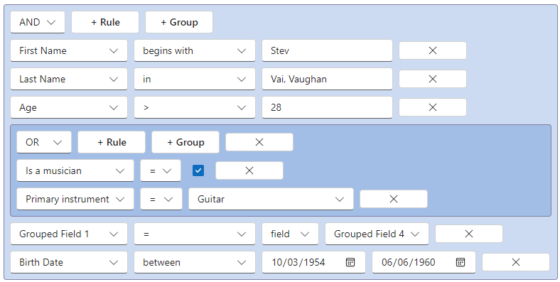

## @react-querybuilder/fluent

Official [react-querybuilder](https://npmjs.com/package/react-querybuilder) compatibility package for [Fluent UI](https://github.com/microsoft/fluentui).

- [Demo](https://react-querybuilder.js.org/demo/fluent)
- [Full documentation](https://react-querybuilder.js.org/)
- [CodeSandbox](https://react-querybuilder.js.org/sandbox?t=fluent) / [StackBlitz](https://react-querybuilder.js.org/sandbox?p=stackblitz&t=fluent) example projects



## Installation

```bash
npm i react-querybuilder @react-querybuilder/fluent @fluentui/react-components @fluentui/react-icons-mdl2
# OR yarn add / pnpm add / bun add
```

## Usage

To configure the query builder to use Fluent-compatible components, place `QueryBuilderFluent` above `QueryBuilder` and beneath `FluentProvider` in the component hierarchy.

```tsx
import { FluentProvider, webLightTheme } from '@fluentui/react-components';
import { QueryBuilderFluent } from '@react-querybuilder/fluent';
import { useState } from 'react';
import { type Field, QueryBuilder, type RuleGroupType } from 'react-querybuilder';

const fields: Field[] = [
  { name: 'firstName', label: 'First Name' },
  { name: 'lastName', label: 'Last Name' },
];

export function App() {
  const [query, setQuery] = useState<RuleGroupType>({ combinator: 'and', rules: [] });

  return (
    <FluentProvider theme={webLightTheme}>
      <QueryBuilderFluent>
        <QueryBuilder fields={fields} defaultQuery={query} onQueryChange={setQuery} />
      </QueryBuilderFluent>
    </FluentProvider>
  );
}
```

`QueryBuilderFluent` is a React context provider that assigns the following props to all descendant `QueryBuilder` elements. The props can be overridden on the `QueryBuilder` or used directly without the context provider.

| Export                  | `QueryBuilder` prop             |
| ----------------------- | ------------------------------- |
| `fluentControlElements` | `controlElements`               |
| `fluentTranslations`    | `translations`                  |
| `FluentActionElement`   | `controlElements.actionElement` |
| `FluentDragHandle`      | `controlElements.dragHandle`    |
| `FluentNotToggle`       | `controlElements.notToggle`     |
| `FluentShiftActions`    | `controlElements.shiftActions`  |
| `FluentValueEditor`     | `controlElements.valueEditor`   |
| `FluentValueSelector`   | `controlElements.valueSelector` |

> [!TIP]
>
> By default, this package uses icons from `@fluentui/react-icons-mdl2` for button labels. To reset button labels to their default strings, use `defaultTranslations` from `react-querybuilder`.
>
> ```tsx
> <QueryBuilderFluent translations={defaultTranslations}>
> ```
