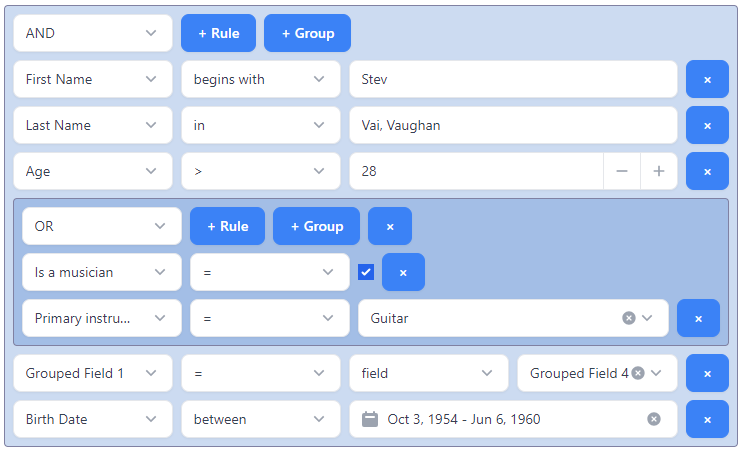

## @react-querybuilder/tremor

Official [react-querybuilder](https://npmjs.com/package/react-querybuilder) compatibility package for [Tremor](https://www.tremor.so/).

- [Demo](https://react-querybuilder.js.org/demo/tremor)
- [Full documentation](https://react-querybuilder.js.org/)
- [CodeSandbox](https://react-querybuilder.js.org/sandbox?t=tremor) / [StackBlitz](https://react-querybuilder.js.org/sandbox?p=stackblitz&t=tremor) example projects



## Installation

```bash
npm i react-querybuilder @react-querybuilder/tremor @tremor/react
# OR yarn add / pnpm add / bun add
```

## Usage

To configure the query builder to use Tremor-compatible components, place `QueryBuilderTremor` above `QueryBuilder` in the component hierarchy.

```tsx
import { useState } from 'react';
import { QueryBuilderTremor } from '@react-querybuilder/tremor';
import { type Field, QueryBuilder, type RuleGroupType } from 'react-querybuilder';

const fields: Field[] = [
  { name: 'firstName', label: 'First Name' },
  { name: 'lastName', label: 'Last Name' },
];

export function App() {
  const [query, setQuery] = useState<RuleGroupType>({ combinator: 'and', rules: [] });

  return (
    <QueryBuilderTremor>
      <QueryBuilder fields={fields} defaultQuery={query} onQueryChange={setQuery} />
    </QueryBuilderTremor>
  );
}
```

`QueryBuilderTremor` is a React context provider that assigns the following props to all descendant `QueryBuilder` elements. The props can be overridden on the `QueryBuilder` or used directly without the context provider.

| Export                    | `QueryBuilder` prop             |
| ------------------------- | ------------------------------- |
| `tremorControlElements`   | `controlElements`               |
| `tremorControlClassnames` | `controlClassnames`             |
| `TremorActionElement`     | `controlElements.actionElement` |
| `TremorNotToggle`         | `controlElements.notToggle`     |
| `TremorShiftActions`      | `controlElements.shiftActions`  |
| `TremorValueEditor`       | `controlElements.valueEditor`   |
| `TremorValueSelector`     | `controlElements.valueSelector` |
